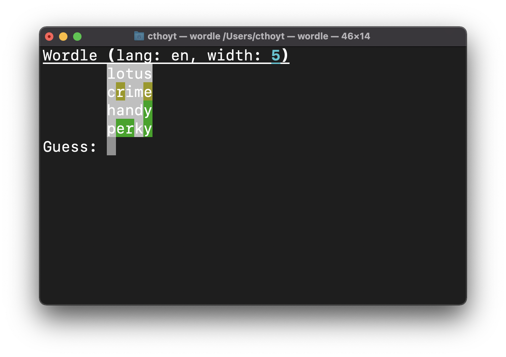
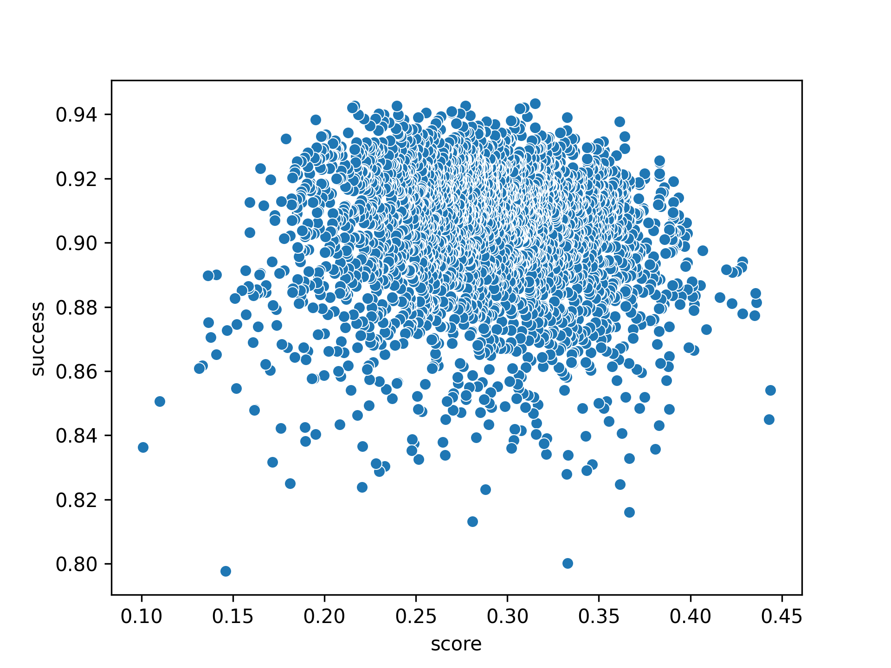

# Wordle

Pyrdle (pronounced purr-dul) is [Wordle](https://www.powerlanguage.co.uk/wordle)
implemented in Python.

Contributions welcome, but I don't have a ton of interest in providing support
on this code, so use at your own risk.

## Install and Play

```shell
$ pip install pyrdle
$ wordle
```

Use `--help` to see how to set the game to have a different number of letters,
different number of guesses, or to use a different language.



### Notes, See Also, and Acknowledgements

- The english word list is from https://pypi.org/project/english-words/. This
  has some weird stuff missing from it.
- The german word list comes from
  the [Leibniz-Institute für Deutsche Sprache](https://www.ids-mannheim.de/en/s/corpus-linguistics/projects/methods-of-analysis/corpus-based-lemma-and-word-form-lists/)
- An implementation of Wordle in R: https://github.com/coolbutuseless/wordle
- A tiny Wordle guessing companion in Python https://pypi.org/project/pywordle/

## Why We're Really Here: to Ruin Wordle

I originally wrote this after talking to @scolby33 and @deoxys314 because I
wanted to write an algorithm to play Wordle for me. I started by creating a way
of simulating a game, then realized there were lots of ways to play, so
naturally I wanted to be able to figure which was best.

This repository assesses two metrics about each algorithm:

1. Success: how many of the words of the given length and number of guesses can
   it successfully solve?
2. Efficiency: what's the average number of guesses needed over all successful
   words?

Later, this repository will run multiple trials in order to assign confidence
intervals for success and quality for randomized algorithms.

## Strategies

This repository is a playground for implementing new solve strategies. Feel free
to send a PR with your own (just subclass the `Player` class)!

Terminology:

1. **Perfect guess**: a guess that uses all previous information available,
   including knowledge about correct positions, unused letters, and used letters

### Initial Fixed Guesses with Successive Greedy Choices

This algorithm takes a list of one, two, three, etc. initial guesses and always
does them in order. This strategy lets you maximize the number of unique letters
you can get information (e.g., if you pick three words, you can potentially get
information about 15 letters in the standard 5-column variant of the game).
However, this strategy sacrifices the positional information learned during
these guesses as they are not used.

After the initial guesses, the algorithm tabulates all the constraints it
learned (e.g., which letters are in the right position, which letters are
present but in the wrong position, and what letters are not present). It then
reads through the dictionary and picks the first word that matches all the
constraints. If this isn't the winner, it updates the constraints and continues.
This works quite well!

The obvious follow-up questions are:

1. How often does this work?
2. How many initial words do I need?
3. What are the best words?
4. Can this algorithm be improved?

The answer to 4 is yes: rather than picking just the first word, you can rank
all the remaining words by "entropy" and pick the highest one. But now let's
look at the other questions for different possible 1, 2, and 3-word fixed
initial guesses. Each word is given an entropy score by first calculating the
letter frequencies across all words of the given length then performing a
weighted sum of the unique letters in a word based on their frequencies.
Therefore, words containing a larger variety of frequent letters get the highest
entropy scores.

#### One Fixed Guess

For each of the ~3.5 5-letter words in the English dictionary, I chose that word
as the initial word, then ran the fixed guess with successive greedy choices
algorithm for all possible Wordle games starting with all words. Then I
calculated the number of games where the algorithm was successful. The following
chart shows entropy score of each initial guess vs. the percentage success rate
across all games on all words. I was expecting a weak linear relation between
score and success, but there almost isn't one at all. It turns out, if you're a
perfect guesser, then Wordle is just too easy most of the time. I bet that the
few failures were due to the naïveté of the algorithm, which could be improved
the way I described above.



### Three Fixed Guesses

We actually got into this whole thing because we thought that we needed three
letters to start it off. Mamma Hoyt said she had picked Ariel, thump, and gowns
as her initial guesses. I hadn't even considered doing this at the moment, so I
was off to the races. My sister came up with the same idea, and had chosen
weary, ghost, lions.

This strategy involves deterministically guessing three words that cover a wide
variety of vowels and consonants. For example, (lunch, metro, daisy) covers all
five vowels and 10 different consonants.

It's pretty likely that with these choices, you will be able to
deterministically solve for the word after one more perfect guess. It turns out
that with this example, you can solve 96.9% of the time with an average of 4.27
guesses. That's pretty surprising, but also assumes you have computer-like
recall of words.

I haven't quite got around to scoring all the possible 3-letter starts. First,
it will take a loooong time, and I'm not willing to leave Python to finish
this (it will then stop being fun). Second, I haven't yet determined if the
following statement is true or not:

> The best performing word in the 1 word variant of this algorithm will also
> appear in the best performing pair of words in the 2 word variant

If this is true, then all of those considerations of implementation will go out
the window, so I will need to think about it a bit more!